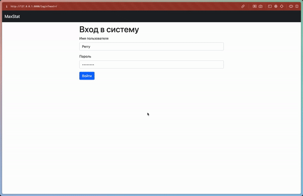

# Веб-приложение для планирования загрузки производственных мощностей

## Описание


## Основные функции

Реализован ролевой доступ на рабочих и администраторов

### Для рабочих:

- Заполнение и сдача формы с отчетом об изготовленных за смену деталях

### Для администраторов:

- Просмотр сводной таблицы-плана <br>
  Слева заказы: количество деталей на изготовление и текущий прогресс изготовления вычисленный по отчетам <br>
  Справа таблица смена/станок с соответствующими отчетами или планами в каждой ячейке
- CRUD отчетов от имени любого сотрудника
- CRUD заказов
- CRUD станков
- CRUD деталей
- CRUD пользователей

## Запуск

1. Склонируйте репозиторий
2. Установите зависимости
```bash
pip install -r requirements.txt
```
3. Примените миграции
```bash
python manage.py migrate
```
4. Запустите команду demo_setup для создания демонстрационных данных
```bash
python manage.py demo_setup
```
5. Запустите сервер
```bash
python manage.py runserver
```

